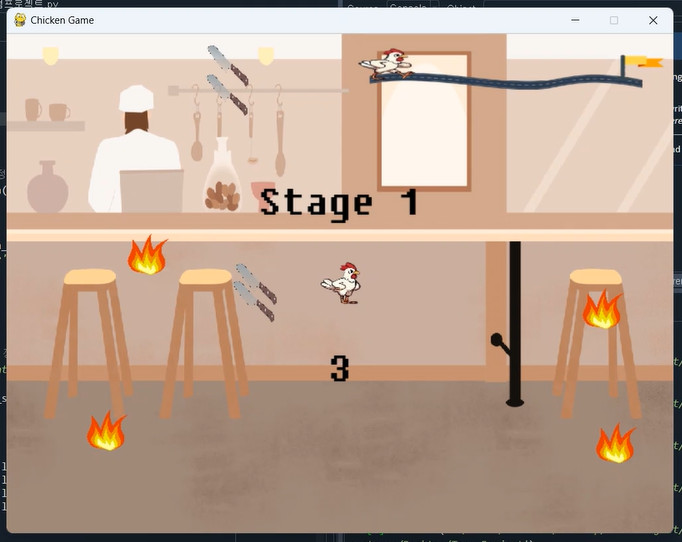
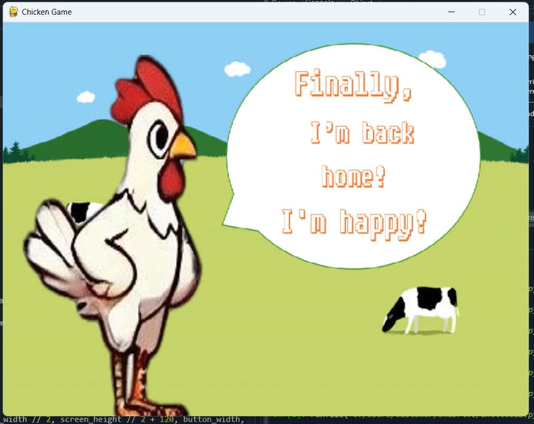

# I don't want to be fried chicken 게임 파이썬으로 구현하기 🐔
- 23100269 박민서
## 프로젝트 설명
이 치킨 게임은 플레이어가 닭이 되어 다양한 장애물을 피하면서 여러 스테이지를 통해 생존하는 게임입니다.
각 스테이지마다 다른 환경과 도전이 기다리고 있으며, 보호갑옷 아이템을 통해 잠시 동안 무적 상태가 될 수 있습니다. 이 게임은 Pygame 라이브러리를 사용하여 개발했습니다.
코드에서 사용한 이미지들은 제가 직접 만들었거나, 이미지생성ai로 만들었거나, 이미지무료배포사이트(https://kr.freepik.com/) 를 통해 다운받았습니다. 
## 게임 설명

1. **스테이지 1: 주방의 공포**
   - **장애물**: 칼, 불길
   - **설명**: 주방에서 날아다니는 칼과 불길을 피하며 닭이 무사히 탈출해야 합니다. 아직 까진 장애물이 많이 빠르지 않아요!

2. **스테이지 2: 도로의 지옥**
   - **장애물**: 자동차, 오토바이, 트럭
   - **설명**: 닭이 도로 위를 지나가며 질주하는 차량들을 피해 이동해야 합니다. 장애물이 많아졌고 빨라졌습니다!

3. **스테이지 3: 야생의 도전**
   - **장애물**: 여우, 뱀, 호랑이
   - **설명**: 닭이 야생 동물들이 사는 숲 속에서 살아남아야 합니다. 장애물이 더 많아졌고 더 빨라졌습니다!

4. **보호갑옷 아이템**
   - **설명**: 보호갑옷 아이템을 획득할 때마다 10초 동안 무적 상태가 되어 장애물에 부딪혀도 생존할 수 있습니다. 전략적으로 아이템을 사용하여 위험을 피하세요.

## 메뉴설명
1. **시작 화면** - 게임을 시작할 때 처음으로 표시되는 화면입니다.
   


화면을 보면 
- Start
- How to
- Exit
  
세가지 버튼으로 구성되어 있습니다.

Exit를 누르면 게임이 종료됩니다. 

How to 버튼을 누르면


이렇게 게임을 설명하는 화면이 나옵니다. back 버튼을 누르면 다시 시작화면으로 돌아갑니다. 

2. **stage 1 화면**
   


모든 stage는 시작 전에 3초간 카운트를 하고 시작합니다.


stage 1 게임이 진행되는 화면입니다. 닭이 있고, 칼과 불의 장애물, 아이템이 있는 걸 확인할 수 있습니다.

3. **stage 2 화면**
   


stage 2 게임이 진행되는 화면입니다. 차와 트럭, 오토바이로 장애물이 바뀐 걸 확인할 수 있습니다. 그리고 타이머 옆의 그림도 닭이 목적지에 더 가까워 진 것으로 변했습니다.

4. **stage 3 화면**
   


stage 3 게임이 진행되는 화면입니다. 여기서 닭이 아이템을 획득해서 갑옷을 입은 닭으로 변한 것을 볼 수 있고, 또 타이머 옆의 그림도 닭이 목적지에 더더욱 가까워졌습니다.

5. **성공화면**
   


stage 3까지 게임을 성공하면, 닭이 가고싶었던 목장으로 도착한 모습이 보입니다.

6. **실패화면**
    


만약 게임 실패 시 닭이 식당에서 치킨이 된 화면이 나타납니다.

7. **실패후**
    


실패하면 game over화면이 뜹니다. 버튼은
- Restart
- Quit

Restart버튼은 stage1 부터 재시작하는 것이고, Quit버튼은 게임을 끝내는 버튼입니다.

## 요구사항 
이 프로젝트를 실행하려면 다음이 필요합니다: 
- Python 3.x
- Pygame 라이브러리
-  이미지 및 폰트 파일 (제가 이미지는 images 파일 안 pmsimages에 저장해두었어요.)

## 설치 및 실행 방법 
1. Python 3.x 설치:
   - [Python 공식 웹사이트](https://www.python.org/)에서 Python을 다운로드하고 설치하세요.
   
2.  Pygame 라이브러리 설치:
   ```bash
   pip install pygame
 ```

3. 리포지토리를 클론합니다:
git clone https://github.com/minseopark23100269/Term-Project.git

4. 이미지 및 폰트 파일을 프로젝트 디렉토리에 배치합니다:

- 이미지 파일: **images/pmsimages/이미지이름.png** 경로입니다.
- 사용자 정의 폰트 파일: **images/pmsimages/custom_font.ttf** 경로입니다.

5. Spyder에서 게임을 실행합니다:

Spyder를 실행하고, 프로젝트 디렉토리에 있는 23100269박민서텀프로젝트.py 파일을 엽니다.

상단의 "Run" 버튼을 클릭하여 코드를 실행합니다.

## 라이센스
이 프로젝트는 [MIT 라이선스](LICENSE)를 따릅니다.

## 마치며
이 프로젝트를 만들 게 된 동기는 거북이 게임을 수업시간에 과제로 수행하면서 게임만들기에 흥미를 느껴서이다. 거북이게임은 플레이어가 물체를 잡아야 하는 게임이었지만, 나는 플레이어가 장애물을 피해서 도망다니는 게임을 만들고 싶었다. 또 스테이지를 나누고 싶었고, 스테이지가 올라갈 수록 난이도를 더 높이게 하고 싶었다. 
타이머, 장애물, 플레이어 같은 기본적인 요소를 넣었고,
직접 만든 시작화면과 gameover화면에는 여러 버튼을 넣어 UX/UI 디자인 측면에서 퀄리티를 높이려 노력했다.
그리고 게임을 하면서 닭이 움직이는 애니메이션을 구현하였는데, Dall-E(이미지생성ai) 를 이용해 닭이 움직이는 모양을 4가지로 만들어서, 이 이미지가 연속적으로 나타나면서 닭이 자연스럽게 움직이는 것처럼 보이도록 신경썼다. 
그리고 스테이지마다 환경을 다르게 만들어서 플레이어가 좀 더 게임을 재밌게 할 수 있기를 원했다. (+약간 긴박감도 느끼게 하고 싶었다)
그리고 디자인이 미흡하지만 각 stage화면에서 타이머 옆에 닭이 목적지로 가는 그림을 넣었다. stage가 올라갈수록 거리도 가까워지는 걸 볼 수 있다. 
또한 장애물 뿐만 아니라 아이템을 넣어 플레이어가 장애물에 대항할 수 있는 기능을 넣었다. 

이 프로젝트를 진행하면서 아쉬운 점은, 일단 다른 장애물도 애니메이션 기능을 넣었으면 어땠을까 하는 점이다. 내가 그리는 것은 퀄리티가 떨어지고, 이미지생성ai로 만드는 과정은 복잡해서 닭만 구현하지 못했지만, 다른 방법을 강구해서 장애물에도 애니메이션 효과를 넣고 싶다.
또 다른 점은 2명의 플레이어가 게임할 수 있는 환경을 만들지 못한 점이 아쉽다.
사실 이것은 한 명은 화살표키, 다른 한 명은 w,a,s,d키를 이용해 움직이는 것으로 설정해 만들어보려고 시도했지만, 결국 실패했다. 수정에 수정을 거쳐도 제대로 작동을 안 해서 결국 포기하게 되었다. 방학동안 이것을 더 시도해서 2명이 동작할 수 있도록 만들고 싶다. 


   
   


